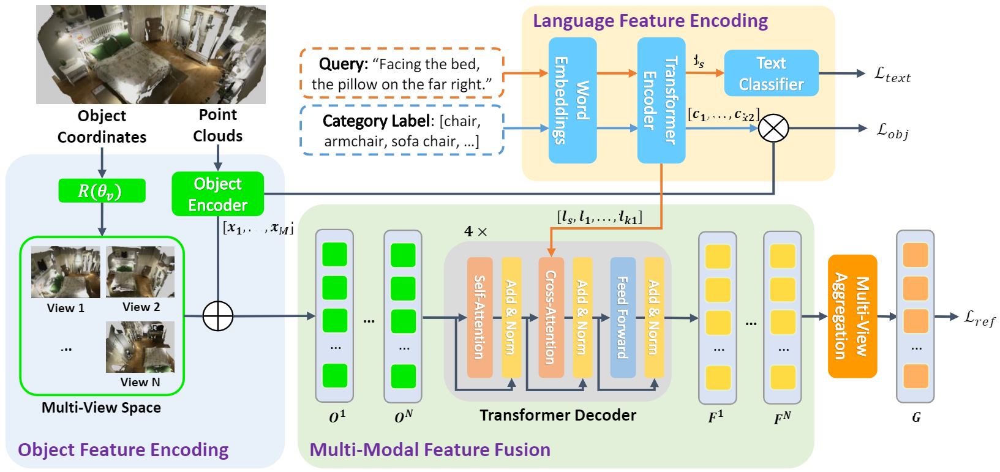

# Multi-View Transformer for 3D Visual Grounding
[Multi-View Transformer for 3D Visual Grounding](https://openaccess.thecvf.com/content/CVPR2022/papers/Huang_Multi-View_Transformer_for_3D_Visual_Grounding_CVPR_2022_paper.pdf) *[CVPR 2022]*


<!-- For ScanRefer dataset, please refer [MVT_ScanRefer](https://github.com/sega-hsj/MVT_ScanRefer) -->

## Installation and Data Preparation
Please refer the installation and data preparation from [referit3d](https://github.com/referit3d/referit3d).

We adopt bert-base-uncased from huggingface, which can be installed using pip as follows:
```Console
pip install transformers
```
you can download the pretrained weight in [this page](https://huggingface.co/bert-base-uncased/tree/main), and put them into a folder, noted as PATH_OF_BERT.


## Training
* To train on either Nr3d or Sr3d dataset, use the following commands
```Console
    python referit3d/scripts/train_referit3d.py \
    -scannet-file $PATH_OF_SCANNET_FILE$ \
    -referit3D-file $PATH_OF_REFERIT3D_FILE$ \
    --bert-pretrain-path $PATH_OF_BERT$ \
    --log-dir logs/MVT_nr3d \
    --n-workers 8 \
    --model 'referIt3DNet_transformer' \
    --unit-sphere-norm True \
    --batch-size 24 \
    --encoder-layer-num 3 \
    --decoder-layer-num 4 \
    --decoder-nhead-num 8 \
    --gpu "0" \
    --view_number 4 \
    --rotate_number 4 \
    --label-lang-sup True
```

* To train nr3d in joint with sr3d, add the following argument
```Console
    --augment-with-sr3d sr3d_dataset_file.csv
``` 

## Validation
* After each epoch of the training, the program will automatically evaluate the performance of the current model. Our code will save the last model in the training as **last_model.pth**, and save the best model following the original Referit3D's repo as **best_model.pth**.


## Test
* At test time, the **analyze_predictions** will run following the original code of Referit3D. 
* The **analyze_predictions** will test the model multiple times, each time using a different random seed. With different random seeds, the sampled point clouds of each object are different. The average accuracy and std will be reported. 

* To test on either Nr3d or Sr3d dataset, use the following commands
```Console
    python referit3d/scripts/train_referit3d.py \
    --mode evaluate \
    -scannet-file $PATH_OF_SCANNET_FILE$ \
    -referit3D-file $PATH_OF_REFERIT3D_FILE$ \
    --bert-pretrain-path $PATH_OF_BERT$ \
    --log-dir logs/MVT_nr3d \
    --resume-path $the_path_to_the_model.pth$ \
    --n-workers 8 \
    --model 'referIt3DNet_transformer' \
    --unit-sphere-norm True \
    --batch-size 24 \
    --encoder-layer-num 3 \
    --decoder-layer-num 4 \
    --decoder-nhead-num 8 \
    --gpu "0" \
    --view_number 4 \
    --rotate_number 4 \
    --label-lang-sup True
```
* To test on joint trained model, add the following argument to the above command
```Console
    --augment-with-sr3d sr3d_dataset_file.csv
``` 

For ScanRefer dataset, please refer [MVT_ScanRefer](https://github.com/sega-hsj/MVT_ScanRefer).

## Citation
```
@inproceedings{huang2022multi,
  title={Multi-View Transformer for 3D Visual Grounding},
  author={Huang, Shijia and Chen, Yilun and Jia, Jiaya and Wang, Liwei},
  booktitle={Proceedings of the IEEE/CVF Conference on Computer Vision and Pattern Recognition},
  pages={15524--15533},
  year={2022}
}
```

## Credits
The project is built based on the following repository:
* [ReferIt3D](https://github.com/referit3d/referit3d).
